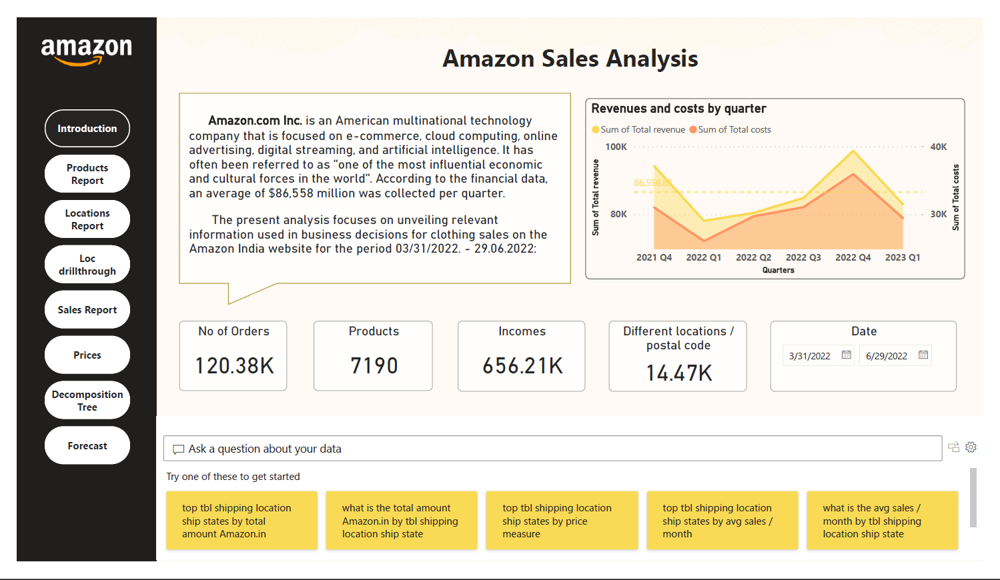
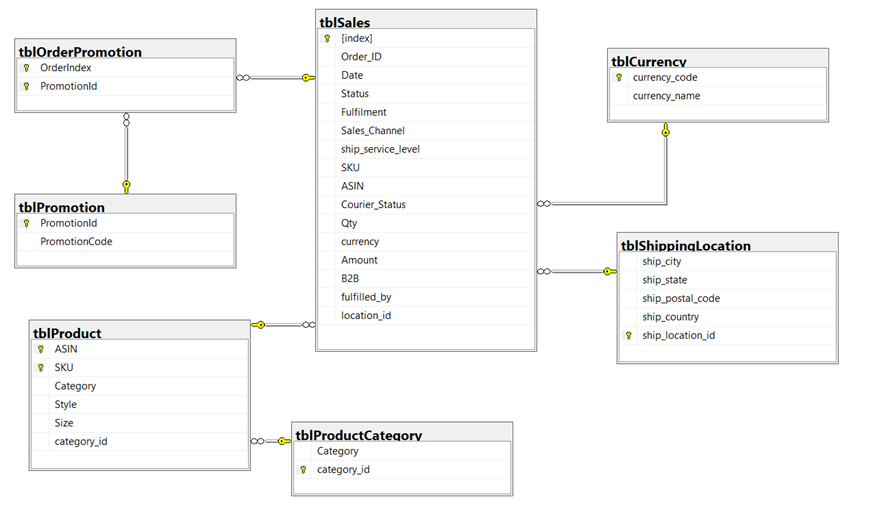
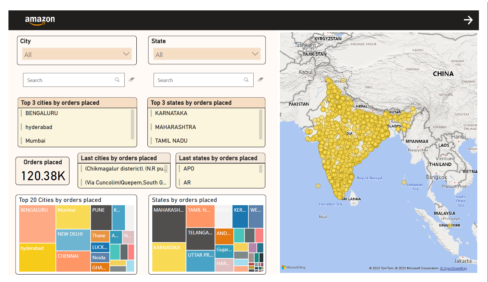
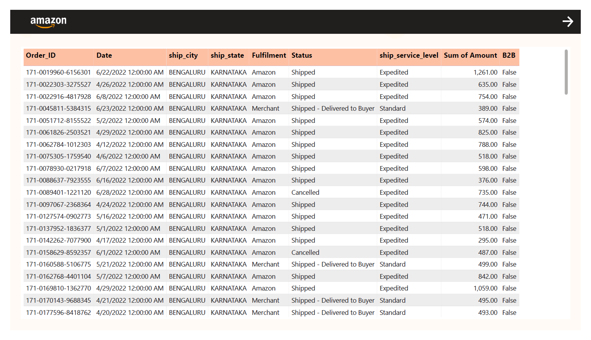
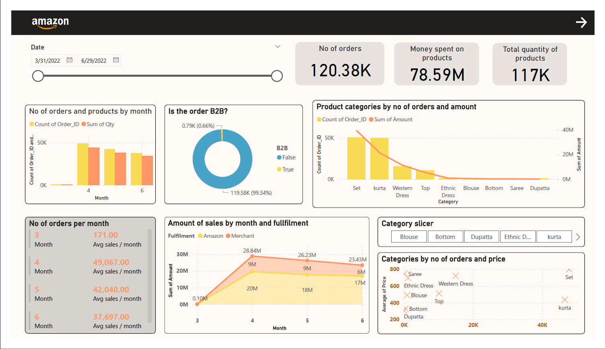
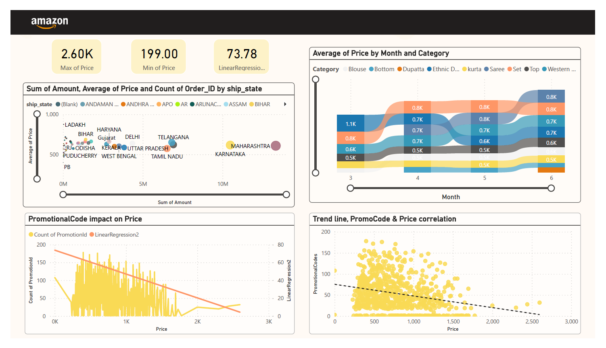
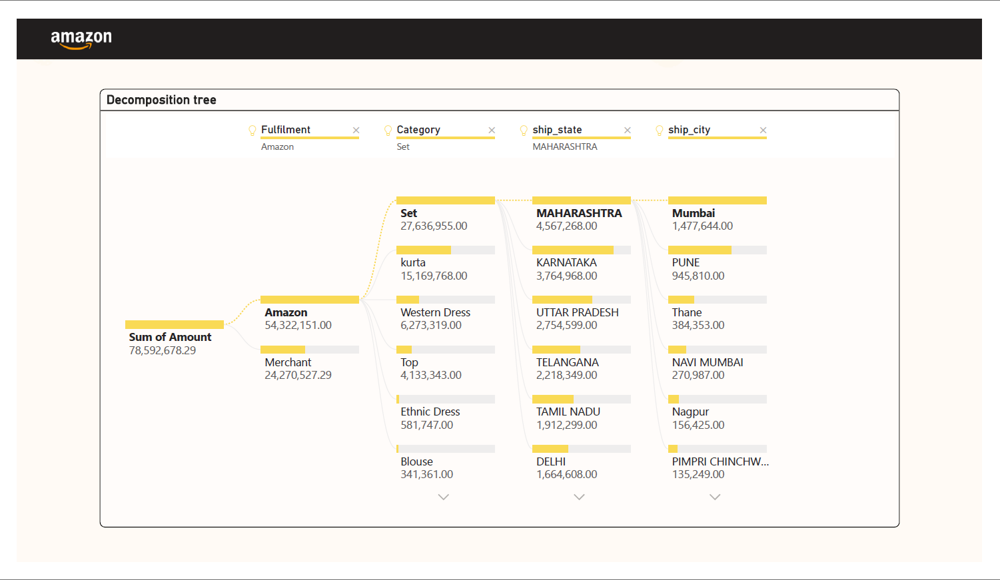
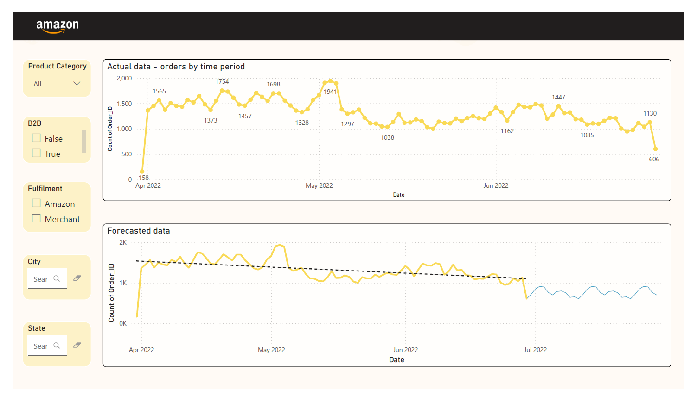

# Data Analysis / Reporting for an E-commerce company
### Project Overview

This Business Intelligence project is based on the "E Commerce Sales" dataset ("Amazon Sales Report.csv"), published on the Kaggle platform, mentioning the original author Anil and [source](https://www.kaggle.com/datasets/thedevastator/unlock-profits-with-e-commerce-sales-data). It contains details about orders and products. I analyzed the company's sales and revenue trends for the period 31.03.2022 and 29.06.2022. By building interactive dashboards, essential information can be revealed and used for possible subsequent business decisions.  
  
### Tools :
- Excel - Data preparation 
- SQL Server / SQL Server Management System - Normalisation & Data analysis
- Microsoft Power BI - reporting / dashboarding

### Data preparation
I decided to **_normalize_** the data to make it easier to add new records to the database and read the existing ones, without having duplicate or ambiguous elements.
To respect first normal form (**_1NF_**), each attribute must have atomic values. I used **Excel** to split by delimiter the promotion-ids column.
Furthermore, I created a new database and imported the dataset into the **SQL Server Management System (SSMS)**. To eliminate functional and transitive dependencies (**2NF & 3NF** ), I created new tables/entities and the corresponding primary and foreign keys. 

  The final ER Diagram looks like this:
  

### Reporting 
#### Power BI
For a better understanding, through the introductory report I have added a brief description of the E-commerce company, as well as of the data to be analyzed. The dataset includes details related to Amazon India's Q2 2022 sales. I considered it relevant to add financial statistics of the company at global level, taken from the source: ["Amazon.com, Inc. - Amazon.com Announces First Quarter Results (aboutamazon.com)"](https://ir.aboutamazon.com/news-release/news-release-details/2023/Amazon.com-Announces-First-Quarter-Results/). I used Power BI functions to add a table from web, similar to a web scraping technique. The chart is based on the global data, and the cards on the initial dataset. 

Similarly, the following reports will reveal information related to the products purchased, the locations where the orders were distributed, total sales, prices, and finally a sales prediction exercise for the next month.

You can find the whole project in the same repository here : [AmazonSalesAnalysis.pbix](https://github.com/mara1103/PowerBI_project/blob/c531336ca3693d7b48727e27da0ab373b47e6f98/AmazonSalesAnalysis.pbix) .

### Conclusions / Results
Through the project, the best-selling products within the company can be identified, as well as the differences between them, the users being able to decide the possible evolution of each product category, improvement or promotion. The most successful categories within the company are: set, kurta and western dress.

The state with the most sales is Maharashtra with 20.8 K orders. Analyzes of sales by location can be useful for making strategic decisions about expanding markets, allocating resources, or developing geographically tailored marketing strategies.

Finally, the project can demonstrate the benefits of using Business Intelligence in the decision-making process in a company. Using the Power BI platform enabled data visualization and analysis in an interactive and efficient way.

## Dashboards (Screenshots)
Below are direct references to the dashboard images included in this repo.

### Overview Dashboard

One line: High‑level KPIs and trends by month, category, and fulfilment.

### Detailed Dashboard

One line: Deeper breakdown with slicers plus monthly orders, sales and category price insights.

For all pages in one place, open the exported PDF: `AmazonSalesAnalysis.pdf`.

## All Dashboards (img folder)
Below are the images from `img/` with one-line explanations so they render correctly on GitHub.

### Overview Dashboard

One line: High-level KPIs and trends by month, category, and fulfilment.

### Products & Sales Details

One line: Deeper breakdown with slicers plus monthly orders, sales and category price insights.

### Introduction Page

One line: Project introduction with global revenue vs. costs and key metrics.

### Orders Table

One line: Transaction-level table of orders, shipment details, status and amounts.

### Decomposition Tree

One line: Root-cause breakdown of Amount by fulfilment, category, state and city.

### Forecast

One line: Actual daily orders with trend and a forecast projection for the next period.

### Prices & Promotions

One line: Price distribution by state/category and promo code impact on price.

### Locations Map

One line: Geographic distribution of orders with top cities and states.
